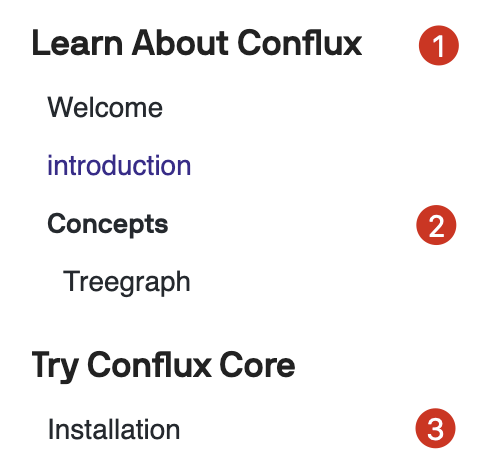

# How To Submit A Repo

- add metadata to your markdown doc file
- create a pr to add your markdown file id to the sidebar file and your repo as
  submodule under docs folder
- add a ci config to trigger the build workflow of this repo

## Add Metadata To Your Markdown File

❸'s title is defined in `en/fullnode-installation.md` like below.
```md
---
id: en/introduction/welcome
title: Welcome
---
```

Other headers can be

```md
---
id: en/js-conflux-sdk/send-a-transaction
title: Markdown Features
hide_title: false
hide_table_of_contents: false
sidebar_label: Markdown :)
custom_edit_url: https://github.com/facebook/docusaurus/edit/master/docs/api-doc-markdown.md
description: How do I find you when I cannot solve this problem
keywords:
  - docs
  - docusaurus
image: https://i.imgur.com/mErPwqL.png
---
```
The `id`, `title` and `custom_edit_url` is required.

The specs can be found
[here](https://v2.docusaurus.io/docs/markdown-features#markdown-headers
"docusaurus markdown-headers documentation").  

## Create A PR To Add Your Doc To `sidebar.js` File

A `sidebar.js` is like the below one

```js
module.exports = {
  docs: {
    en: {
      "Learn About Conflux": [     // sidebar category name ❶
        "en/introduction/welcome", // md file id <language>/<repo_name>/<markdown_id>
        "en/introduction/conflux_introduction",
        {
          Concepts: [              // 2nd level sidebar category name ❷
            "en/introduction/treegraph"
          ]
        }
      ],
      "Try Conflux Core": [
        "en/introduction/fullnode-installation" // md file id ❸
      ]
    }
  }
};
```

Will generate the site like this.

<div class="HTML">
<p align="center"></p>
</div>

## Add A CI Config To Trigger The Build Workflow of This Repo

Create a PR for this repo, add your repo as a git submodule in [docs](./) folder
like the `conflux-portal` one. 

I'll check your repo and submit a PR to add the CI config.

## Why It Works

The CI config in your repo will trigger the build workflow of this repo.

The workflow will pull your repo down, check if any doc files being updated in
the latest commits to your **master** branch depending on the
`conflux-docs.json` file, use docusaurus build the doc and update
developer.conflux-chain.org.